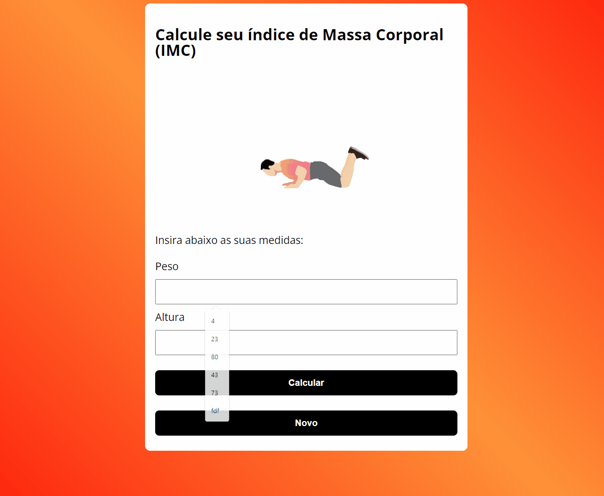

# Calculadora de índice de massa corporal crida em JavaScript

Projeto construído com o objetivo de por em prática o conhecimento adquirido até o momento.

🔗[Clique aqui para acessar](https://pedrodevvv.github.io/Link-Page-NLW)

## 🛠️Tecnologias

* HTML
* CSS
* JavaScript

## ✨Qual o objetivo deste projeto?

Reunir em um só projeto todos os recursos aprendidos até o momento, sendo eles, funções, arrays, objetos, estrutura de decisão e as boas práticas com strings e numbers. Este projeto me permitiu entender melhor como ambas os recurso trabalham e se comportam juntos, assim me proporcionando um pouco do poder do JavaScript 

## 📞 Contato

pedrohgs2004@gmail.com
Linkedin: https://www.linkedin.com/in/pedro-henrique-g-silva-a2100a23a/?originalSubdomain=br

